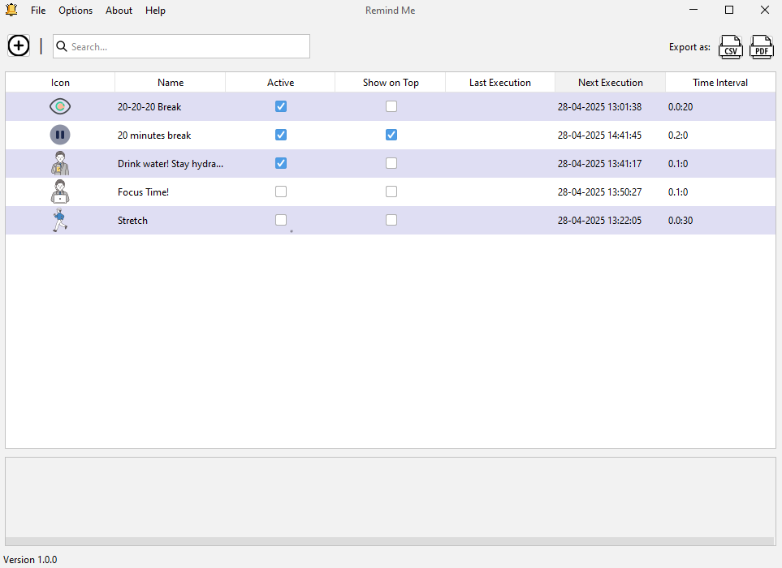
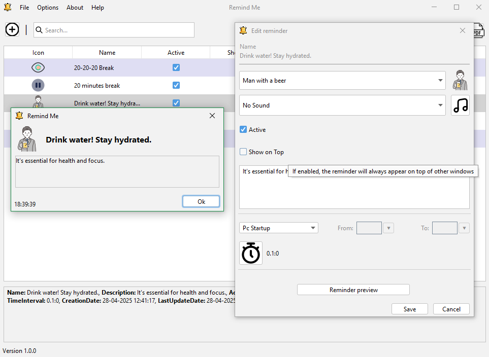
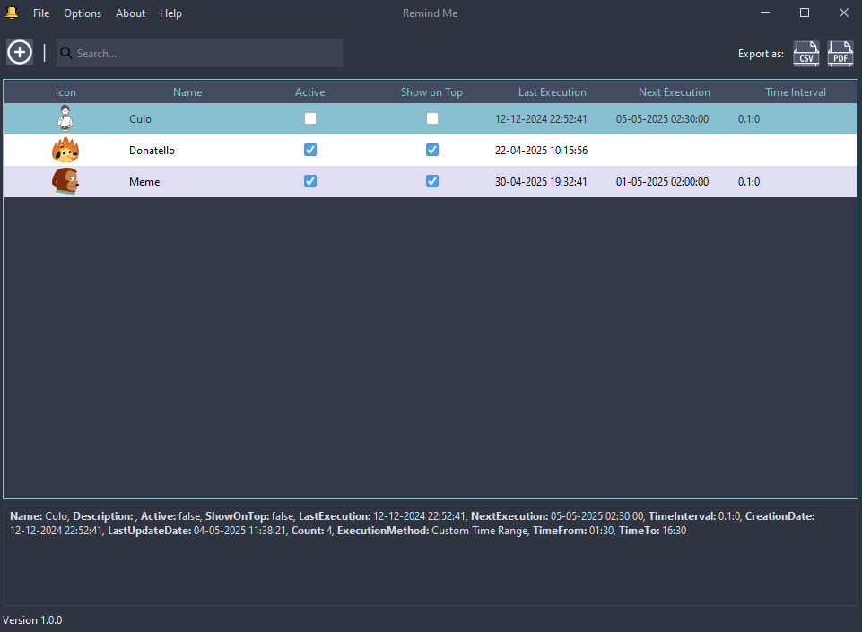
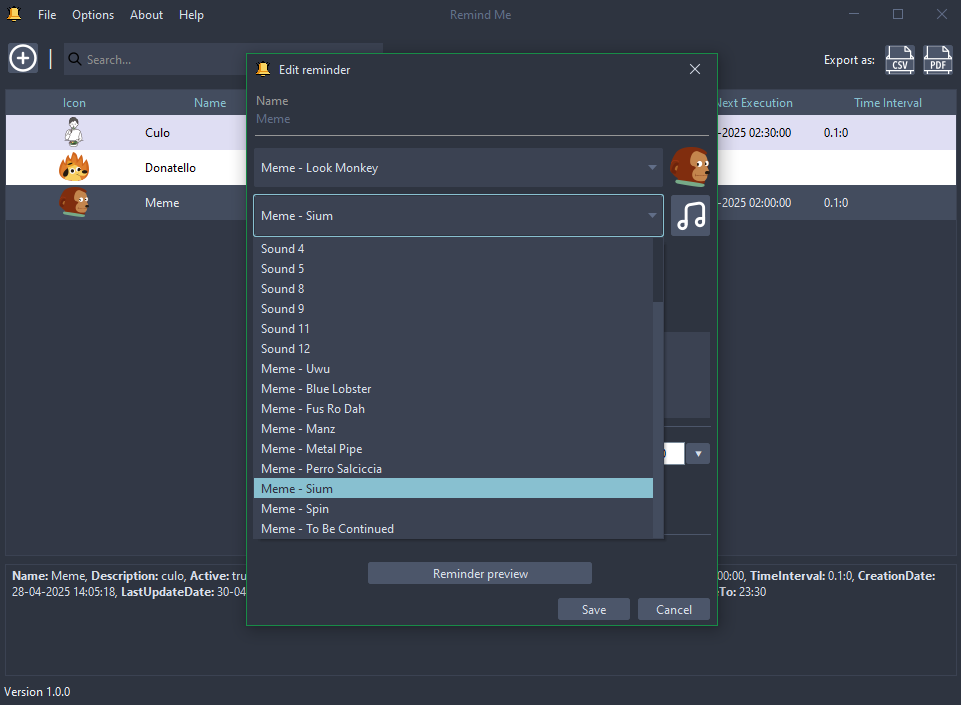

# Remind Me
**RemindMe** is a lightweight and intuitive application designed to help users schedule and execute custom, periodic reminders with ease. Whether it's hourly alerts, daily prompts, or weekly notifications, RemindMe offers full flexibility in defining when and how each reminder appears.

With a simple and user-friendly interface, users can create personalized reminder messages, set specific intervals, and manage their active reminders at any time. Reminders are displayed as clear desktop notifications, ensuring they are seen without being intrusive. The application runs silently in the background and requires no installation, making it a portable and hassle-free solution.

Ideal for task management, regular check-ins, medication schedules, or simply staying on top of daily routines, RemindMe provides a reliable way to stay organized and on time—every time.

# Important Notes:
* If, for any reason, the setup program doesn't add the application to the startup registry (regedit), you can manually run "add_to_startup.bat" located in the installation folder by double-clicking it.
* This program is set to run automatically at PC startup by default. If you disable it, automatic backups will no longer occur.

# Screenshots

# Commands
* To create a new .jar file: `mvn clean package`
* To run the background service: `java -jar ./target/RemindMe-1.0-SNAPSHOT-jar-with-dependencies.jar --background`

## Platforms

| Platform | Availability |
| --- | --- |
| Windows | ✅ |
| Linux | ❌ |
| MacOS | ❌ |

## Supported Languages

| Piattaforma | Availability |
| --- | --- |
| English | ✅ |
| Italian | ✅ |
| Spanish | ✅ |
| German | ✅ |
| French | ✅ |

## Licence

## Time report

## Authors

- [DennisTurco](https://www.github.com/DennisTurco)

## Support

For support, email: dennisturco@gmail.com