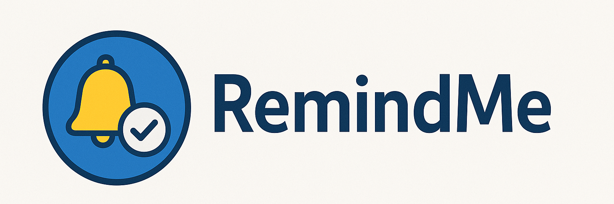

# Remind Me

**RemindMe** is a lightweight and intuitive application designed to help users schedule and execute custom, periodic reminders with ease. Whether it's hourly alerts, daily prompts, or weekly notifications, RemindMe offers full flexibility in defining when and how each reminder appears.</p>

With a simple and user-friendly interface, users can create personalized reminder messages, set specific intervals, and manage their active reminders at any time. Reminders are displayed as clear desktop notifications, ensuring they are seen without being intrusive. The application runs silently in the background and requires no installation, making it a portable and hassle-free solution.

Ideal for task management, regular check-ins, medication schedules, or simply staying on top of daily routines, RemindMe provides a reliable way to stay organized and on time—every time.

# Features

* ⏰ Custom periodic reminders (hourly, daily, weekly, etc.)
* 📝 Personalized messages for each reminder
* 📝 Personalized popups for each reminder
* 🖱️ Minimal and intuitive user interface
* 🧭 Real-time reminder management (view, edit, delete)
* 🖥️ Runs silently in the background

# Screenshots

|  |  |
| ------------------------ | ------------------------ |
|  |  |

# Publish

This project is, of course, published here on GitHub, but it's also available on [itch.io](https://dennis-turco.itch.io/remind-me).

<iframe frameborder="0" src="https://itch.io/embed/3654364?border_width=5&amp;bg_color=ffffff&amp;fg_color=222222&amp;link_color=fa5c5c&amp;border_color=766c6c" width="560" height="175">
  <a href="https://dennis-turco.itch.io/remind-me">Remind Me by Dennis Turco</a>
</iframe>

# Important Notes

* If, for any reason, the setup program doesn't add the application to the startup registry (regedit), you can manually run "add_to_startup.bat" located in the installation folder by double-clicking it.
* This program is set to run automatically at PC startup by default. If you disable it, automatic backups will no longer occur.

# Commands

* To create a new .jar file: `mvn clean package`
* To run the background service: `java -jar ./target/RemindMe-1.0-SNAPSHOT-jar-with-dependencies.jar --background`

## Platforms

| Platform | Availability |
| --- | --- |
| Windows | ✅ |
| Linux | ❌ |
| MacOS | ❌ |

## Supported Languages

| Piattaforma | Availability |
| --- | --- |
| English | ✅ |
| Italian | ✅ |
| Spanish | ✅ |
| German | ✅ |
| French | ✅ |

## Tecnical Documentation

### Protect the SMTP password

To protect the SMTP password, it needs to be encrypted.
The following steps should be performed during the initial setup:

1. Create a file named config.txt in the root directory.
2. Add the password inside the file in this format:

   ```txt
   SMTP_PASSWORD=PasswordToEncrypt
   ```

3. Run remindme.Email.EncryptConfigFile to encrypt the .txt file and generate the corresponding .enc file.

## Licence

[](https://choosealicense.com/licenses/mit/)

## Time report

[](https://wakatime.com/badge/user/ce36d0fc-2f0b-4e85-b318-872804ab18b6/project/9e61a826-ec67-41fc-a225-d50fce9cb025)

## Authors

* [DennisTurco](https://www.github.com/DennisTurco)

## Support

For support, email: [dennisturco@gmail.com](dennisturco@gmail.com)
