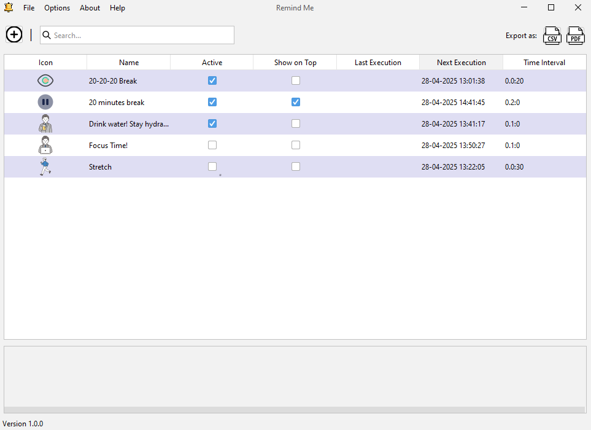
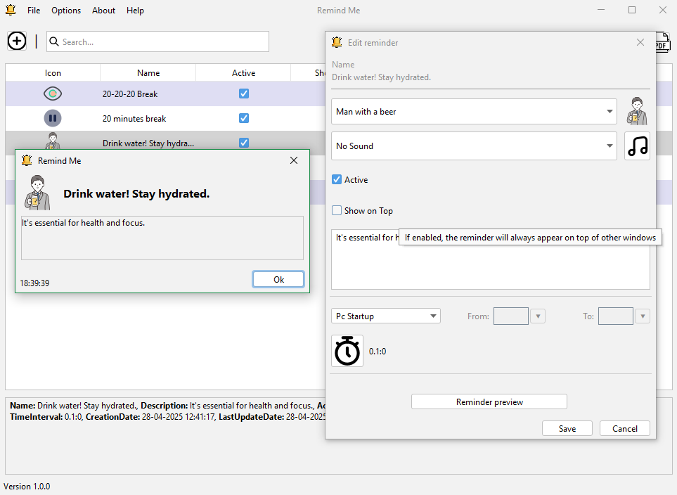
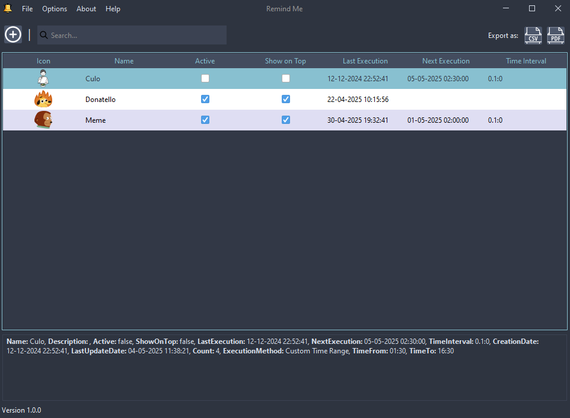
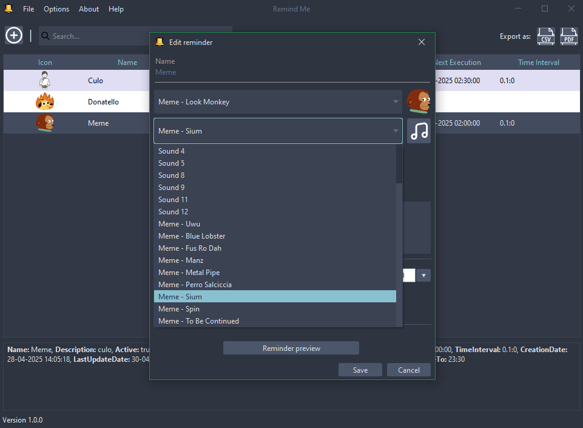

**RemindMe** is a lightweight and intuitive application designed to help users schedule and execute custom, periodic reminders with ease. Whether it's hourly alerts, daily prompts, or weekly notifications, RemindMe offers full flexibility in defining when and how each reminder appears.

With a simple and user-friendly interface, users can create personalized reminder messages, set specific intervals, and manage their active reminders at any time. Reminders are displayed as clear desktop notifications, ensuring they are seen without being intrusive. The application runs silently in the background and requires no installation, making it a portable and hassle-free solution.

Ideal for task management, regular check-ins, medication schedules, or simply staying on top of daily routines, RemindMe provides a reliable way to stay organized and on time-every time.

# Features

* ⏰ Custom periodic reminders (hourly, daily, weekly, etc.)
* 📝 Personalized messages for each reminder
* 📝 Personalized popups for each reminder
* 🖱️ Minimal and intuitive user interface
* 🧭 Real-time reminder management (view, edit, delete)
* 🖥️ Runs silently in the background

# Screenshots

|  |  |
| ------------------------ | ------------------------ |
|  |  |

# Publish

This project is, of course, published here on GitHub, but it's also available on [itch.io](https://dennis-turco.itch.io/remind-me).

# Commands

* To build the Java backend: `mvn clean package`
* To run the backend headless API server: `java -jar ./target/RemindMe-1.0-SNAPSHOT-jar-with-dependencies.jar --serve`
* To run the app in development (from `app/`): `npm run dev`
* To build the Windows installer: see [`code_documentation.md`](src/main/resources/docs/code_documentation.md#11-building-the-installer)
* To build the Linux installers (AppImage + .deb): run the "Build Linux installers" GitHub Action manually (Actions tab > Run workflow), or on a Linux machine put a Linux JRE in `jre-linux/` and run `npm run build:linux` from `app/`
* To build the macOS installers (.dmg for Apple Silicon and Intel): run the "Build macOS installers" GitHub Action manually, or on a Mac put the JREs in `jre-mac-arm64/` and `jre-mac-x64/` and run `npm run build:mac` from `app/`

## Platforms

| Platform | Availability |
| --- | --- |
| Windows | ✅ |
| Linux | ✅ |
| MacOS | ✅ |

## Supported Languages

| Piattaforma | Availability |
| --- | --- |
| English | ✅ |
| Italian | ✅ |
| Spanish | ✅ |
| German | ✅ |
| French | ✅ |

## Licence

## Time report

## Authors

* [DennisTurco](https://www.github.com/DennisTurco)

## Support

For support, email: [dennisturco@gmail.com](dennisturco@gmail.com)
