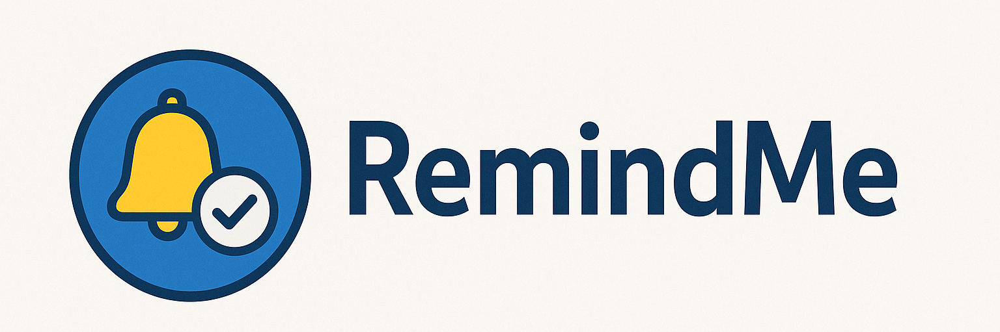

<center>  </center>

# RemindMe – Technical Documentation

## 1. Overview

RemindMe is a desktop reminder manager made of two parts that run together as one app:

- A **headless Java backend** (`remindme.MainApp`, started with `--serve`) that owns the SQLite
  database and exposes a local REST API on `http://localhost:8765`.
- An **Electron + React (TypeScript) frontend** (`app/`) that renders the UI and talks to the
  backend exclusively over that REST API. In production, Electron's main process spawns the
  backend JAR as a child process using a JRE bundled alongside the app; in development, you run
  both processes yourself (see [Running in development](#4-running-in-development)).

This is a rewrite of an older Java Swing desktop app. The Swing GUI, its background/tray service
and its JSON-file-based preferences store have all been retired in favor of this
Electron/SQLite/REST architecture.

## 2. Architecture

```
┌─────────────────────────────┐        HTTP (localhost:8765)        ┌──────────────────────────────┐
│  Electron main process      │ ───────────────────────────────────▶│  Java backend (Javalin)      │
│  (app/electron/*.ts)        │◀─────────────────────────────────── │  remindme.Api.ApiServer      │
│   - spawns the backend JAR  │                                     │   - ReminderController       │
│   - polls GET /reminders/due│                                     │   - ReminderRepository       │
│   - IPC bridge to renderer  │                                     │   - PreferencesRepository    │
└───────────────┬──────────────┘                                    └───────────────┬───────────────┘
                │ contextBridge (IPC)                                               │ JDBC
                ▼                                                                    ▼
┌─────────────────────────────┐                                     ┌──────────────────────────────┐
│  React renderer (app/src)   │                                     │  SQLite database              │
│   - MainPage, dialogs        │                                     │  res/reminders.db             │
│   - i18n (app/res/languages) │                                     │   - reminders table           │
└─────────────────────────────┘                                     │   - preferences table         │
                                                                      └──────────────────────────────┘
```

The renderer never talks to the backend directly: it calls a `window.remindMe` bridge
(`app/src/lib/ipc.ts`) exposed by the preload script, which forwards to the Electron main process,
which in turn calls the REST API via `app/electron/apiClient.ts`. This keeps `fetch`/file-system
access out of the renderer and mirrors how the desktop notification popups
(`app/src/pages/ReminderPopupPage.tsx`) are opened as separate `BrowserWindow`s.

A `DuePoller` in `app/electron/main.ts` polls `GET /reminders/due` on an interval (configurable via
`config.json`'s `ReminderService.value`, in minutes) and opens a popup window for every reminder
that becomes due. The backend marks a reminder as "shown" (updates `lastExecution`/`nextExecution`)
as a side effect of that same endpoint.

## 3. Project structure

### Backend (`src/main/java/remindme/`)

| Package      | Responsibility |
|---------------|----------------|
| `Api`         | `ApiServer` (Javalin route table) and `ReminderController` (HTTP handlers). |
| `Sqlite`      | `Database` (connection + schema migration), `ReminderRepository`, `PreferencesRepository`. |
| `Entities`    | Domain objects: `Remind`, `Preferences`, `RemindListPath`, `TimeInterval`. |
| `Enums`       | `ConfigKey` (reads `config.json`), `IconsEnum`, `SoundsEnum`, `LanguagesEnum`, `ThemesEnum`, `ExecutionMethod`, `TranslationLoaderEnum`. |
| `Services`    | `SchedulingService`, `TimeIntervalService`, `ExportService` (CSV), `SuggestionsSeeder` (seeds example reminders on first run). |
| `Json`        | `JSONReminder` — only used for one-time migration of a legacy JSON remind list into SQLite. |
| `Helpers`     | Small value types such as `TimeRange`. |

`MainApp` is the entry point. It loads `config.json`, opens the SQLite connection, wires up the two
repositories, migrates legacy JSON data into SQLite if the tables are still empty, seeds example
reminders on a brand-new database, and starts the Javalin server.

### Frontend (`app/`)

| Path                     | Responsibility |
|---------------------------|----------------|
| `electron/main.ts`        | App lifecycle, window management, `DuePoller`, IPC handlers, spawns the backend JAR in production. |
| `electron/apiClient.ts`   | `fetch` wrapper around the backend REST API (main-process side, so file dialogs can live there too). |
| `electron/preload.ts`     | `contextBridge` exposing `window.remindMe` to the renderer. |
| `src/lib/ipc.ts`          | Renderer-side `remindMe` bridge type + a browser-only fallback implementation (for previewing the UI outside Electron, e.g. `npm run dev:vite-only`). |
| `src/lib/i18n.tsx`        | Translation provider/hook (`useI18n`, `t(category, key, fallback)`), see [Internationalization](#7-internationalization-i18n). |
| `src/lib/catalog.ts`      | Static catalogs mirroring the Java enums: icon/sound options, execution-method options and their translation keys. |
| `src/pages/`              | `MainPage` (the main list + details panel), `ReminderPopupPage` (notification popup route). |
| `src/components/`         | Dialogs: create/edit form, preferences, confirm, prompt, time picker, reminder preview, onboarding wizard. |
| `res/languages/*.json`    | Translation files, fetched at runtime from `/languages/<lang>.json`. |

## 4. Running in development

Backend:
```bash
mvn -o compile
# then run remindme.MainApp with argument --serve, e.g. via your IDE's run configuration
```

Frontend + Electron (from `app/`):
```bash
npm install
npm run dev        # runs Vite and Electron together, waits for the backend on :8765
```

Useful individual commands:
- `npm run dev:vite-only` — Vite dev server only, using the in-memory browser fallback bridge
  (no backend/Electron required) — handy for quick UI-only iteration.
- `npm run typecheck` — type-checks both the renderer and the Electron main process.
- `mvn test` — runs the JUnit 5 backend test suite.

## 5. Dependencies

Backend (`pom.xml`):
- **Javalin** — embedded HTTP server for the REST API.
- **sqlite-jdbc** — SQLite driver.
- **Gson** — JSON (de)serialization for the API wire format and legacy migration.
- **slf4j-api** / **logback-classic** — logging.
- **JUnit 5** — testing.

Frontend (`app/package.json`):
- **Electron** — desktop shell.
- **React** + **react-router-dom** — UI and the popup-window route.
- **react-markdown** + **remark-gfm** — renders reminder descriptions (and onboarding copy) as Markdown.
- **date-fns** — date formatting.
- **Vite** + **electron-builder** — dev server/bundler and installer packaging.

## 6. Database

SQLite database file: `res/reminders.db` (created and migrated automatically by
`remindme.Sqlite.Database` on startup).

- **`reminders`** — one row per reminder: name (primary key), description, schedule fields
  (`timeIntervalDays/Hours/Minutes`, `timeRangeStart/End`, `executionMethod`), state
  (`isActive`, `isTopLevel`, `remindCount`, `lastExecution`, `nextExecution`), and presentation
  fields (`icon`, `sound`).
- **`preferences`** — a single row (`id = 1`) holding `language`, `theme` and the legacy
  `remindListDirectory`/`remindListFile` path (kept for the one-time JSON migration).

On first run, if the `preferences` table is empty, the backend migrates the old
`res/config/preferences.json` file if it exists, otherwise it seeds default preferences — the app
never falls back to reading that JSON file again afterwards. The same pattern applies to reminders:
a legacy `remind_list*.json` is migrated once into the `reminders` table if it's still empty.

## 7. REST API

All routes are defined in `remindme.Api.ApiServer` and served at `http://localhost:8765`.

| Method & Path                          | Description |
|-----------------------------------------|-------------|
| `GET /health`                           | Liveness check. |
| `GET /reminders`                        | List all reminders. |
| `GET /reminders/search?q=`              | Search reminders by name. |
| `GET /reminders/due`                    | Reminders due now; marks them as shown as a side effect. |
| `GET /reminders/{name}`                 | Get one reminder. |
| `POST /reminders`                       | Create a reminder. |
| `PUT /reminders/{name}`                 | Update a reminder. |
| `DELETE /reminders/{name}`              | Delete a reminder. |
| `POST /reminders/{name}/duplicate`      | Duplicate a reminder (appends `_copy` to the name). |
| `POST /reminders/{name}/rename`         | Rename a reminder. |
| `POST /reminders/{name}/active`         | Enable/disable a reminder. |
| `POST /reminders/{name}/topLevel`       | Toggle "always on top" for a reminder. |
| `GET /export/csv`                       | Export all reminders as CSV. |
| `GET /export/json`                      | Export all reminders as JSON. |
| `POST /import/json`                     | Replace the whole reminder list from a JSON array. |

Dates are serialized as ISO-8601 strings; enums (`icon`, `sound`, `executionMethod`) are serialized
as their name string, matching `app/src/lib/types.ts` one-to-one.

## 8. Internationalization (i18n)

Supported languages: Italian (default), English, German, Spanish, French
(`app/src/lib/i18n.tsx`, `LanguageCode` = `ITA | ENG | DEU | ESP | FRA`).

- Translation files live in `app/res/languages/{ita,eng,deu,esp,fra}.json`, grouped by category
  (`General`, `MainFrame`, `RemindList`, `ManageRemindDialog`, `Dialogs`, `ExecutionMethod`,
  `Onboarding`, ...).
- Components call `t(category, key, fallbackText)` from `useI18n()`; the fallback is shown while
  the JSON hasn't loaded yet or if a key is missing, so the UI never renders empty text.
- **When adding a new user-facing string**, add the key under the right category in **all five**
  language files, not just `ita.json` — a call with a category/key that doesn't exist in a given
  language file silently falls back to the Italian/English text you hardcoded, which is easy to
  miss. There's no automated check for this yet; the fastest way to verify is to grep every
  `t("Category", "Key", ...)` call in `app/src` and confirm the pair exists in each of the five
  JSON files.
- The selected language is persisted to `localStorage` (`remindme-language`) and also sent to the
  Electron main process (`remindMe.setLanguage`) so native menus/tray text stay in sync.

## 9. Logging

The backend uses **Logback**, configured in [`src/main/resources/logback.xml`](../logback.xml).
Logs go to the console and to `res/logs/application.log`, rolled over daily and kept for 7 days.
Change the level in the `<root level="...">` tag (`debug`, `info`, `warn`, `error`); no code
changes needed.

## 10. Testing

- Backend: `mvn test` (JUnit 5). Tests live in `src/test/java/test/`.
- Frontend: `npm run typecheck` in `app/` (there is no frontend unit test suite yet — UI changes
  should be verified manually via `npm run dev`).

## 11. Building the installer

Producing the distributable Windows installer is a two-step pipeline: **electron-builder** first
produces an unpacked, ready-to-run copy of the app, then **Inno Setup** wraps that into a single
installer `.exe`. This mirrors the sibling DailyPill project's packaging setup.

### Step 1 — electron-builder (unpacked app)

```bash
cd app
npm run build:electron
```

This runs, in order:

1. **`npm run build`** — type-checks and builds the renderer (`vite build` → `app/dist/`) and
   compiles the Electron main process (`tsc -p electron/tsconfig.json` → `app/dist-electron/`).
2. **`npm run build:backend`** — runs `mvn -o package -DskipTests` in the repo root, producing
   `target/RemindMe-1.0-SNAPSHOT-jar-with-dependencies.jar`.
3. **`electron-builder`** — assembles everything into `app/release/win-unpacked/` (the `"win"."target"`
   in `app/package.json`'s `"build"` section is `"dir"`, i.e. an unpacked folder, not a self-contained
   installer), using:
   - `dist/` and `dist-electron/` (the built app code),
   - `res/` → bundled as `resources/res` (icons, sounds, translation files, `config.json`),
   - `../jre/` → bundled as `resources/jre` (a full JRE so end users don't need Java installed),
   - the backend JAR → bundled as `resources/backend/RemindMe.jar`.

At runtime, `app/electron/main.ts`'s `spawnBackend()` launches
`resources/jre/bin/java.exe -jar resources/backend/RemindMe.jar --serve` as a child process
whenever the app is *not* running from source (`app.isPackaged`).

### Step 2 — Inno Setup (installer .exe)

Open [`installer/RemindMe.iss`](../../../../installer/RemindMe.iss) in the Inno Setup Compiler and
build it (`Ctrl+F9`), or run it headless with `ISCC.exe installer\RemindMe.iss`. It packages
`app/release/win-unpacked/` as-is and produces `installer/Output/RemindMe_Setup_<version>.exe`.

### Prerequisites

- A local JRE at `../jre` (relative to `app/`), i.e. `jre/` at the repo root — see
  `.gitignore`, it is intentionally not committed and must be provided locally (or downloaded by a
  release script) before packaging.
- A Windows icon at `app/build/icon.ico`, referenced both by electron-builder
  (`"win": { "icon": "build/icon.ico" }` in `app/package.json`) and by the Inno Setup script
  (`SetupIconFile`).
- Keep the version number in sync before releasing: bump it in `app/package.json`'s `version` field
  and in `installer/RemindMe.iss`'s `AppVersion` (they are independent and not read from a shared
  source, so both need updating by hand).
